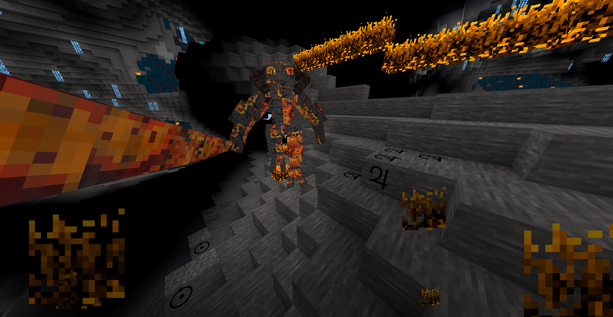

### Mobs Balrog
  
**_Adds balrogs._**

**Version:** 0.4.0
**Source code's license:** [LGPL v2.1][1]  
**Media (Textures, Models, Sounds) license:** [CC-BY-SA 3.0 Unported][2]

**Dependencies:** default, tnt (found in [Minetest Game][3]), mobs ([Mobs Redo][4])  

### Installation

Unzip the archive, rename the folder to mobs_balrog and place it in  
../minetest/mods/

If you only want this to be used in a single world, place it in  
../minetest/worlds/WORLD_NAME/worldmods/

GNU+Linux - If you use a system-wide installation place it in  
~/.minetest/mods/

For further information or help see:  
https://wiki.minetest.net/Help:Installing_Mods

[1]: https://www.gnu.org/licenses/old-licenses/lgpl-2.1.en.html
[2]: https://creativecommons.org/licenses/by-sa/3.0/
[3]: https://github.com/minetest/minetest_game
[4]: https://forum.minetest.net/viewtopic.php?t=9917
